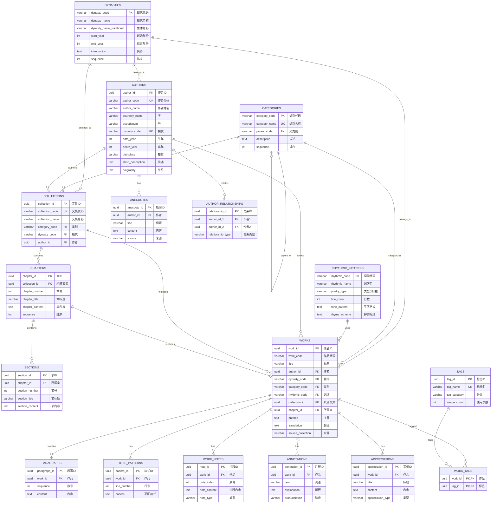

# 中国古典诗词文学数据库 - ER 图

## 实体关系图 (Mermaid)



## 简化版关系图

```
┌─────────────────────────────────────────────────────────────────────────────┐
│                              基础参考表                                       │
├─────────────────────────────────────────────────────────────────────────────┤
│                                                                             │
│  ┌──────────────┐    ┌──────────────┐    ┌───────────────────┐             │
│  │  DYNASTIES   │    │  CATEGORIES  │    │ RHYTHMIC_PATTERNS │             │
│  │   (朝代)     │    │   (类别)     │    │     (词牌)        │             │
│  └──────┬───────┘    └──────┬───────┘    └─────────┬─────────┘             │
│         │                   │                      │                        │
└─────────┼───────────────────┼──────────────────────┼────────────────────────┘
          │                   │                      │
          ▼                   ▼                      ▼
┌─────────────────────────────────────────────────────────────────────────────┐
│                              核心实体                                        │
├─────────────────────────────────────────────────────────────────────────────┤
│                                                                             │
│  ┌──────────────┐                      ┌──────────────┐                    │
│  │   AUTHORS    │◄────────────────────►│    WORKS     │                    │
│  │   (作者)     │     writes           │   (作品)     │                    │
│  └──────┬───────┘                      └──────┬───────┘                    │
│         │                                     │                             │
│         │                    ┌────────────────┼────────────────┐           │
│         ▼                    ▼                ▼                ▼           │
│  ┌──────────────┐    ┌──────────────┐ ┌──────────────┐ ┌──────────────┐   │
│  │  ANECDOTES   │    │  PARAGRAPHS  │ │ TONE_PATTERNS│ │  WORK_NOTES  │   │
│  │   (轶闻)     │    │   (段落)     │ │   (平仄)     │ │   (注释)     │   │
│  └──────────────┘    └──────────────┘ └──────────────┘ └──────────────┘   │
│                                                                             │
└─────────────────────────────────────────────────────────────────────────────┘

┌─────────────────────────────────────────────────────────────────────────────┐
│                              层级结构 (四书五经等)                            │
├─────────────────────────────────────────────────────────────────────────────┤
│                                                                             │
│  ┌──────────────┐    ┌──────────────┐    ┌──────────────┐                  │
│  │ COLLECTIONS  │───►│   CHAPTERS   │───►│   SECTIONS   │                  │
│  │   (文集)     │    │    (章)      │    │    (节)      │                  │
│  └──────────────┘    └──────────────┘    └──────────────┘                  │
│                                                                             │
└─────────────────────────────────────────────────────────────────────────────┘

┌─────────────────────────────────────────────────────────────────────────────┐
│                              标签与赏析                                      │
├─────────────────────────────────────────────────────────────────────────────┤
│                                                                             │
│  ┌──────────────┐    ┌──────────────┐    ┌──────────────┐                  │
│  │     TAGS     │◄──►│  WORK_TAGS   │◄──►│    WORKS     │                  │
│  │    (标签)    │    │  (关联表)    │    │              │                  │
│  └──────────────┘    └──────────────┘    └──────┬───────┘                  │
│                                                  │                          │
│                      ┌──────────────┬────────────┘                          │
│                      ▼              ▼                                       │
│              ┌──────────────┐ ┌──────────────┐                             │
│              │ ANNOTATIONS  │ │APPRECIATIONS │                             │
│              │   (词注)     │ │   (赏析)     │                             │
│              └──────────────┘ └──────────────┘                             │
│                                                                             │
└─────────────────────────────────────────────────────────────────────────────┘
```

## 数据流向图

```
                    JSON 数据源
                        │
        ┌───────────────┼───────────────┐
        ▼               ▼               ▼
   ┌─────────┐    ┌─────────┐    ┌─────────┐
   │ 全唐诗  │    │  宋词   │    │四书五经 │
   │poet.*.json│  │ci.*.json│   │ *.json  │
   └────┬────┘    └────┬────┘    └────┬────┘
        │              │              │
        ▼              ▼              ▼
   ┌─────────────────────────────────────────┐
   │           IMPORT_BATCHES                │
   │            (导入批次)                    │
   └─────────────────────────────────────────┘
                    │
        ┌───────────┼───────────┐
        ▼           ▼           ▼
   ┌─────────┐ ┌─────────┐ ┌─────────┐
   │ AUTHORS │ │  WORKS  │ │RHYTHMIC │
   │         │ │         │ │PATTERNS │
   └─────────┘ └────┬────┘ └─────────┘
                    │
        ┌───────────┼───────────┐
        ▼           ▼           ▼
   ┌─────────┐ ┌─────────┐ ┌─────────┐
   │PARAGRAPHS│ │  NOTES │ │TONE_PAT │
   └─────────┘ └─────────┘ └─────────┘
```

## 渲染说明

要渲染 Mermaid 图表，您可以：

1. **GitHub**: 直接在 GitHub 上查看此文件，会自动渲染
2. **VS Code**: 安装 "Markdown Preview Mermaid Support" 扩展
3. **在线工具**: 使用 https://mermaid.live/ 粘贴代码渲染
4. **导出图片**: 使用 mermaid-cli 工具生成 PNG/SVG
